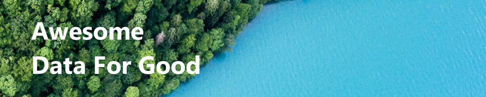

# Awesome Data For Good

## Compilations
- 🐳 [Biodiversity](/biodiversity.md)
- 🌍 [Climate](/climate.md)

## Contribution guidelines
This compilation of resources is open, please open a PR if you wish to add some interesting links. If you have any questions, please send an email to theo.alves.da.costa@gmail.com

## About Data For Good
We are a French community of 2500+ Data Scientists willing to use their skills for impactful projects about climate change, biodivesity, ethics, inclusion, health. 
Learn more at https://dataforgood.fr/
